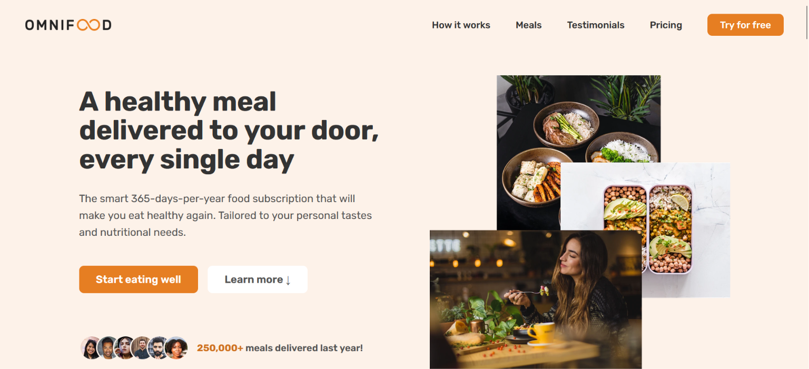
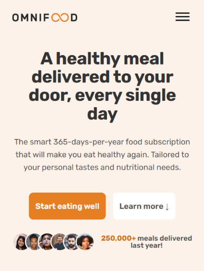

# Omnifood

<table>
<tr>
<td></td>
<td></td>
</tr>
</table>

Landing page for Omnifood — a made-up AI meal subscription brand. Built this as a front-end practice project to get comfortable with responsive layouts.

**Live demo:** https://mohamedwaellll.github.io/OmniFood/

## What's on the page

Sticky nav that shows up once you scroll past the hero, a hamburger menu on mobile, smooth scrolling between sections, testimonials, meal cards, pricing plans, and a signup form at the bottom. Layout is Flexbox/Grid, so it holds up from desktop down to phone width.

## Stack

HTML, CSS, vanilla JS. No frameworks, no build step — clone it and open `index.html`, that's it.

## Structure

```
OmniFood/
├── index.html
├── css/
│   ├── style.css
│   ├── style.min.css
│   ├── general.css
│   └── queries.css
├── img/
├── javascript/
│   └── script.js
└── manifest.webmanifest
```

## Running it

```bash
git clone https://github.com/mohamedwaellll/OmniFood.git
```

Open `index.html` in your browser. No dependencies to install.

## What I learned

First time building a fully responsive site from scratch, and a few things finally clicked.

The `font-size: 62.5%` trick on `html` was one of them. Set the root font-size that way and 1rem becomes 10px instead of the default 16px — makes all the rem-based spacing and type scale actually make sense instead of feeling random.

I leaned on CSS Grid a lot more than I expected to. Used to just reach for Flexbox out of habit, but for things like the hero layout, testimonials, and pricing plans, Grid was just... easier, since I needed to control rows and columns at once. The `.grid--2-cols` through `.grid--5-cols` classes came out of that.

Sticky nav was the annoying part. Went with an `IntersectionObserver` on the hero section instead of checking scroll position — once the hero scrolls out of view, the header gets a `sticky` class added. Felt like overkill for a nav bar at first, but it's way less janky than doing math on every single scroll event.

Mobile took the most time overall. Five separate breakpoints in `queries.css`, and turns out "hide the menu, add a hamburger" is not actually the hard part — the hard part is the overlay animation (`translateX(100%)` plus opacity, plus `visibility: hidden` when closed) and making sure it's still accessible when it's not visible. That one took a few tries before it stopped feeling broken.

## Notes

Pricing, testimonials, meal names — all made up. This was purely a styling and layout exercise, not a real business.
